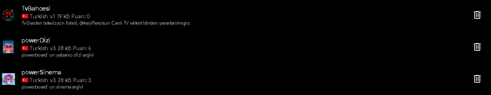
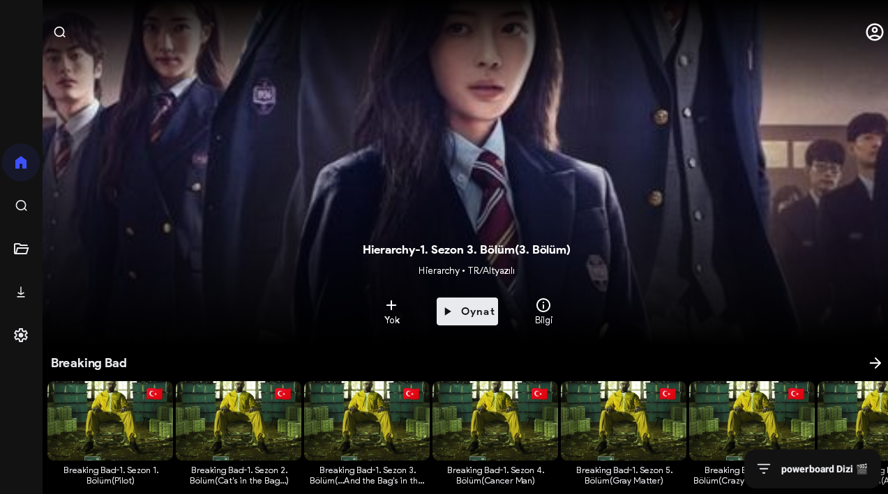
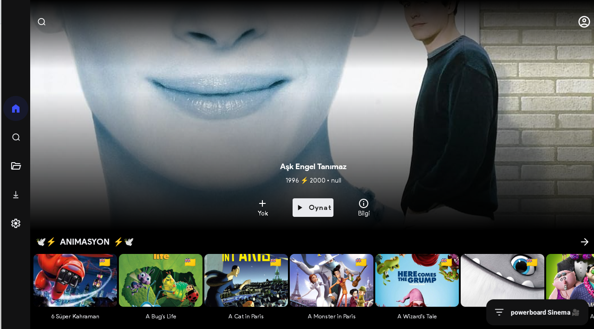
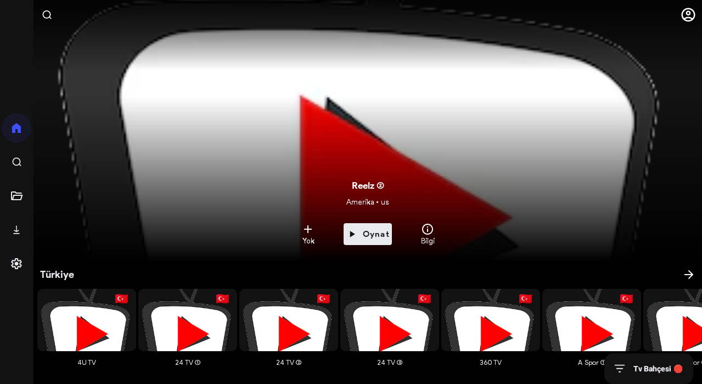

# 🚀 Sinetech Eklentileri 

 <!-- Sonradan eklenebilir -->

📦 **Kullanıma Hazır Eklentiler**
| Eklenti | Versiyon | Lisans |
|---------|----------|--------|
| [PowerDizi](powerDizi) |  | [MIT](LICENSE) |
| [PowerSinema](powerSinema) |  | [MIT](LICENSE) |
| [TvBahcesi](TvBahcesi) |  | [MIT](LICENSE) |

---

## 🌟 Öne Çıkan Özellikler

✅ TMDB Entegrasyonu ile zengin içerik bilgisi  
🔍 Gelismis arama ve filtreleme  
📥 Çevrimdışı izleme için indirme desteği  
🎨 Kullanıcı dostu modern arayüz  

[](https://www.themoviedb.org/)

---

## 📺 PowerDizi



### 🛠 Temel Özellikler
| Kategori | Detaylar |
|----------|----------|
| **Desteklenen Tür** | TV Dizileri |
| **Arama** | Tür/Yıl/Puan filtreleme |
| **Entegrasyon** | TMDB API v3 |
| **Platform** | Android/Windows/Linux/macOS |

```markdown
🔸 Ana Sayfa Özellikleri:
- Popüler diziler
- Yeni eklenenler
- Özel koleksiyonlar
- Kişiselleştirilmiş öneriler
```

---

## 🎬 PowerSinema



### 🎞 TMDB Entegrasyon Detayları
| Bilgi | Açıklama |
|-------|-----------|
| Slogan | `movie.tagline` |
| Yönetmen | `credits.crew[0].name` |
| Süre | `runtime` dakika |
| Çıkış Tarihi | `release_date` |

```bash
# Hızlı Kurulum
1. Son sürümü [indirin](https://github.com/GitLatte)
2. Ayarlar > API Anahtarı bölümüne TMDB key'inizi girin
3. "Filmleri Yükle" butonuna tıklayın
```

---

## 📡 TvBahcesi



### 🌍 Desteklenen Kanallar
- 📻 150+ Uluslararası TV Kanalı
- 🌐 50+ Ülkeye özel içerik
- 🎭 20+ Özel kategori

---

## 🛠 Ortak Yapılandırma

### 🔑 TMDB API Kurulumu
1. [TMDB](https://www.themoviedb.org/) üzerinden API anahtarı alın
2. `Ayarlar > API Yapılandırması` bölümüne girin
3. Değişiklikleri kaydedin

```groovy
// build.gradle içinde gerekli bağımlılık
dependencies {
    implementation 'com.sinetech:tmdb-integration:2.4.1'
}
```

---

## 🤝 Katkıda Bulunanlar

| Geliştirici | Rol |
|-------------|-----|
| [GitLatte](https://github.com/GitLatte) | Backend Geliştirme |
| [patr0nq](https://github.com/patr0nq) | Güncelleme ve Geliştirme Ortağı|
| [keyiflerolsun](https://github.com/keyiflerolsun) | Eklenti kodları ilham kaynağı |
| [doGior](https://github.com/DoGior) | Eklenti kodları ilham kaynağı |
| [powerboard](https://forum.sinetech.tr/uye/powerboard.3822/) | PowerDizi-PowerSinema liste yöneticisi |

📬 **Destek İletişim:** [Latte](https://forum.sinetech.tr/konu/powerboard-film-ve-dizi-arsivine-ozel-cloudstream-deposu.3672/)

---

🔔 **Not:** Repoyu eklemek için Cloudstream içerisindeki Depo Ekle alanında Depo URL kısmına "Latte" yazmanız yeterlidir.
